# Thematic LMS
A full stack Learning Management Systen (LMS) application for project 1 at General Assembly.

By John D. Watt and Amitoj Singh

=== App Link ===

You can access the application here: https://thematiclms.herokuapp.com/

=== About this Application ===

Thematic LMS is a learning management system that reverse-engineers three features of the popular Canvas LMS:
- User Authentication
- Assignment Creation
- File Submission

Thematic LMS improves upon Canvas by adding themes that change the color of the site background as well as various UI features.  This full-stack, NEM application uses a mobile-first, responsive design with a simple, modern layout. The appliction demonstrates full CRUD functionality, use of RESTful routes, EJS partials/templating, multple database models with working relationships, and both front-end and back-end data validation. 

=== Technologies Used ===
- Javascript
- jQuery
- CSS
- HTML
- EJS
- Node
- Express
- Mongoose
- Mongo/MongoDB
- Heroku
- Git/GitHub
- Fomantic-UI CSS Framework: a Semantic-UI community fork

=== Screenshots of Site ===

Below, the screenshots of the site also show off the variety of themes available to users: 

- Login and Sign-up Pages

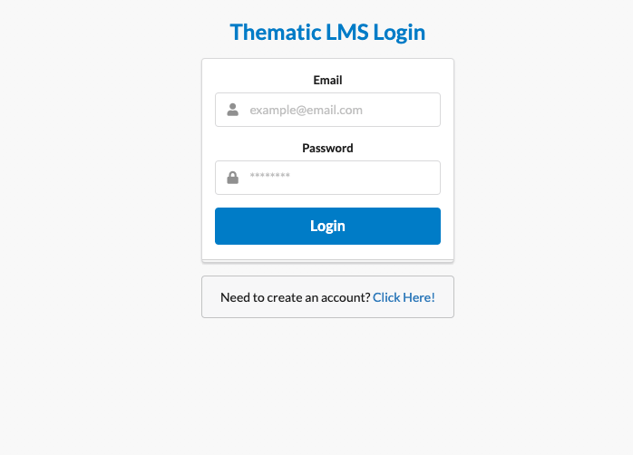

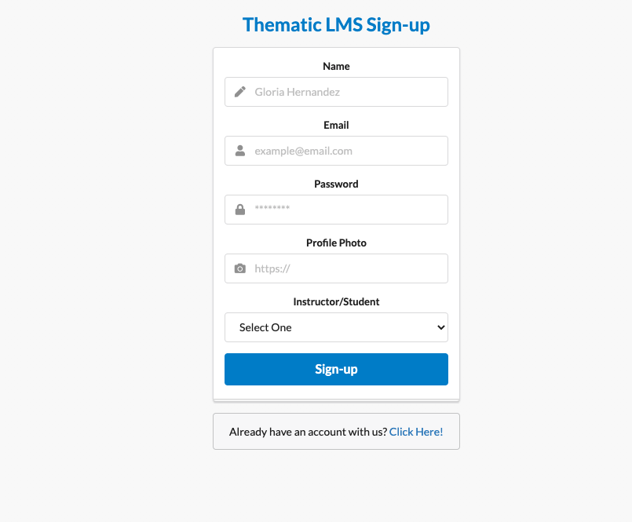

- Assignments Index Page

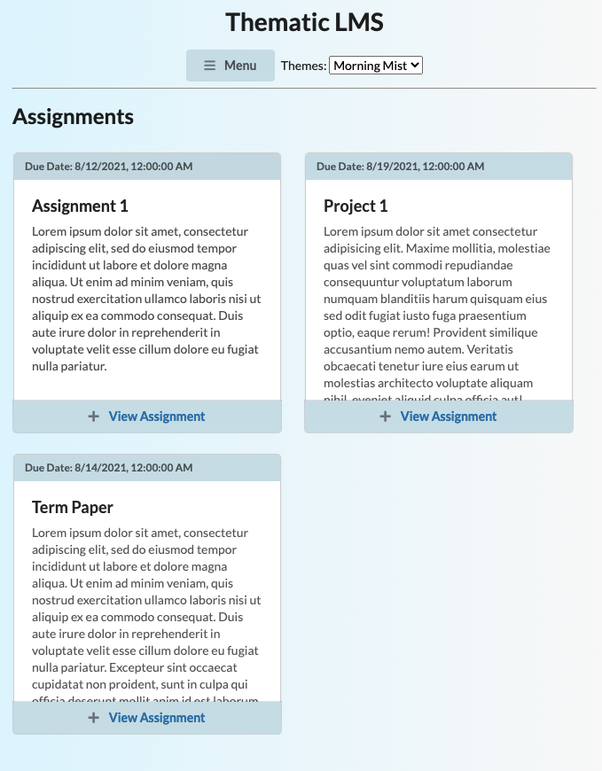

- Assignment Show Page

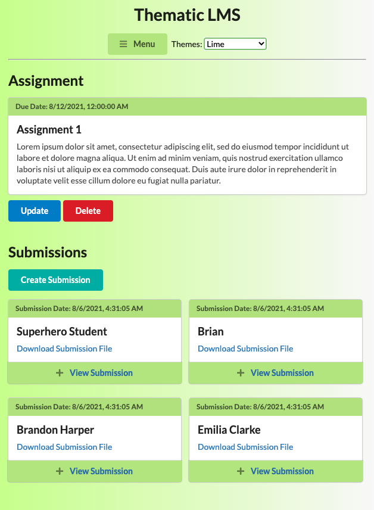

- Submission Show Page

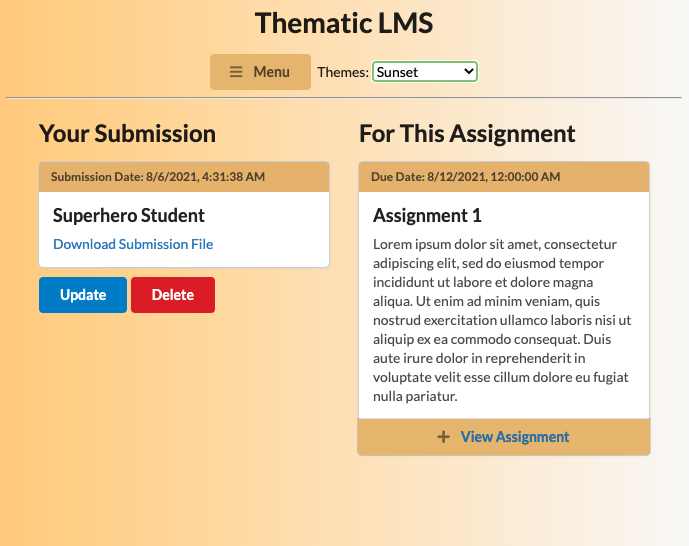

- Create/Update Assignment Page

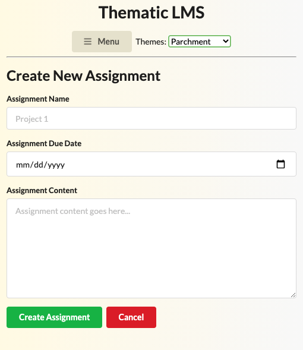

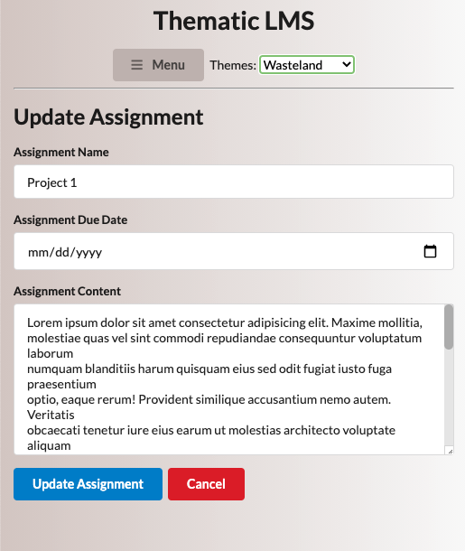

- Create Submission Page

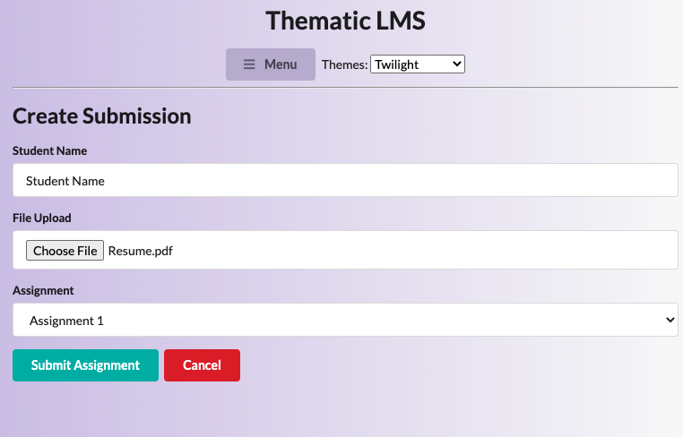

- Sidebar

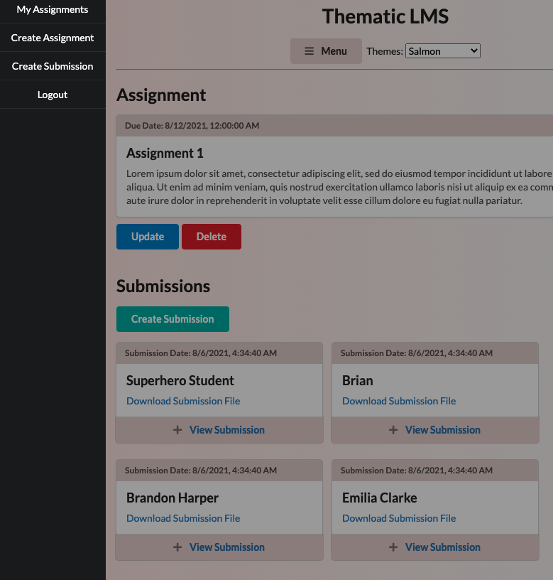

=== User Stories ===

Creating an Account: User will navigate to app register page. User will see 5 inputs: name, email, password, profile picture (optional), and instructor/studen. User will input their name, email and password as text. User will link a url with their profile picture, or they will be assigned a default if left blank. User will select whether they are an instructor or a student. User will then push the button that says sign up and will be redirected to the login page.

Logging In: User will be see a login box with 2 inputs: email, password. User will input their email and password as text. User will then push the button that says login and will be redirected to assignments page.

Accessing All Assignments: Upon logging in, user will be placed on assignments index page. Here, they will see all their assignments stacked on top of each other. Clicking menu at the top will show a navbar on the right with buttons redirecting to various pages. Clicking on specific assignment will take the user to the assignment show page.

Accessing specific assignments with list of submissions: Clicking on specific assignment will take the user to the assignment show page which will have submissions listened underneath the assignment. The assignment will list the name, content, and due date for the assignment.Submissions will list the students name, their submission date, and a link to the file they submitted. Options for updating and deleting the assignment will be below the assignment, as well as creating a submission. 

Creating/updating an assignment/submission: Either the create or update assignment/submission button will take the user to a page with inputs for altering the content of the assignment/submission. If updating, the user will see the saved info from the original assignment already filling the inputs. When complete, the user will select the green/blue button that says create/update assignment/submission. They will be redirected to the show page for thier creation. 

=== Wireframes ===

- Login and Sign-up Pages

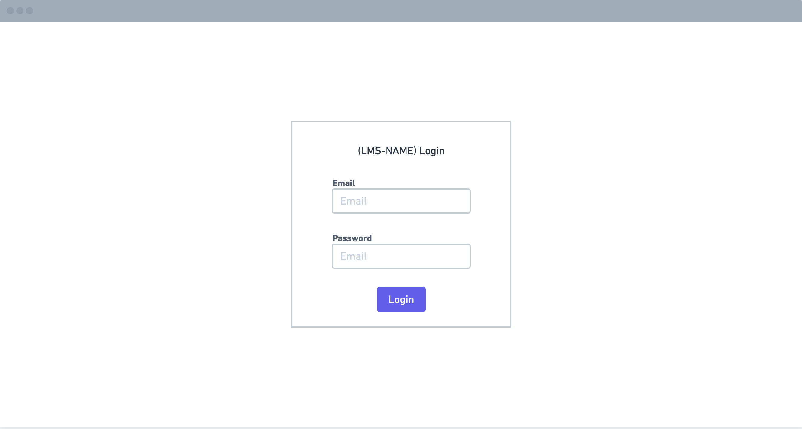

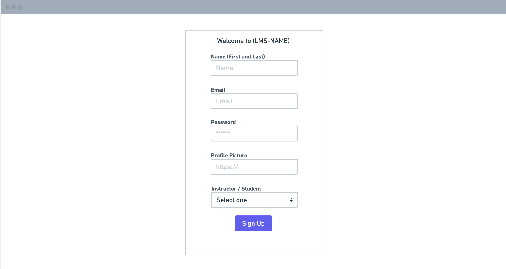

- Assignments Index Page

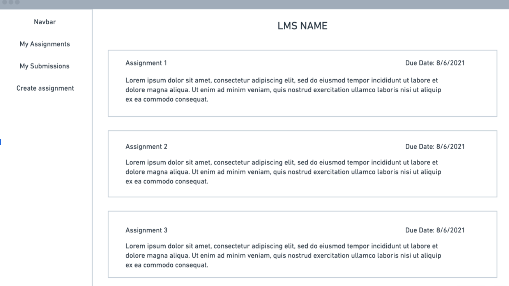

- Assignment Show Page

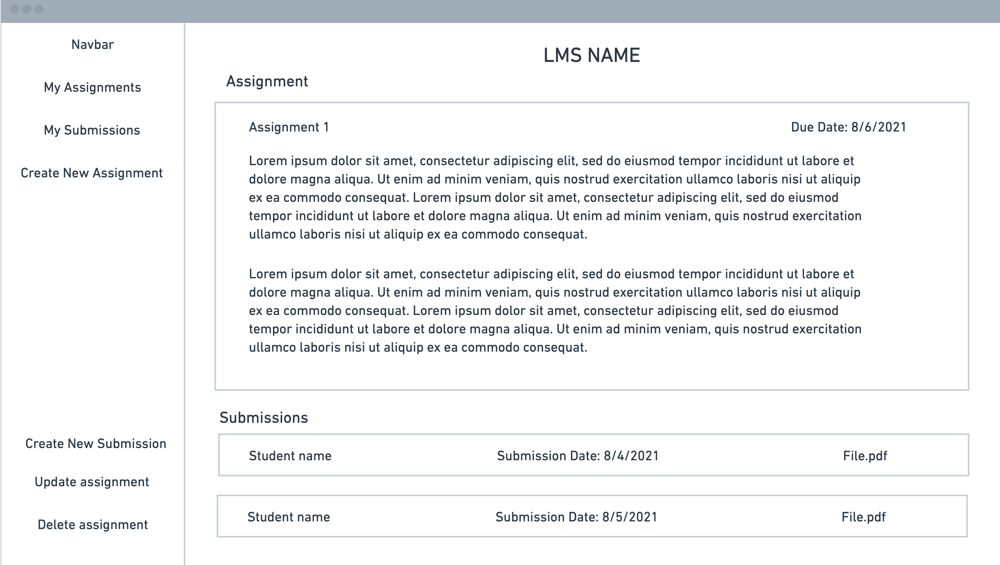

- Submission Show Page

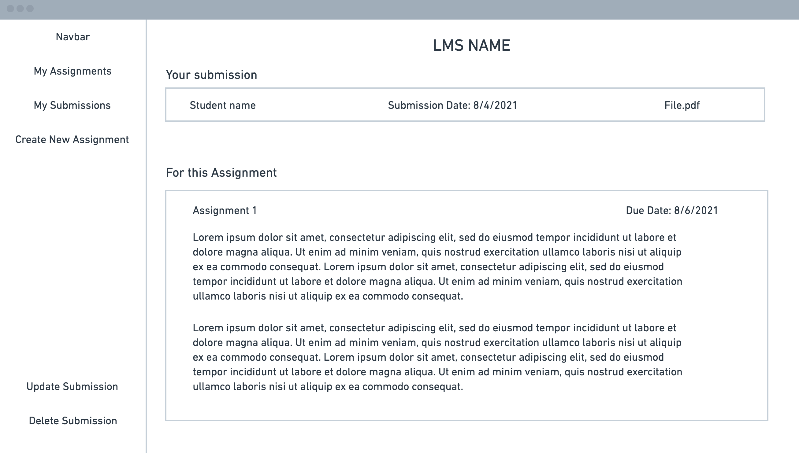

- Create/Update Assignment Page

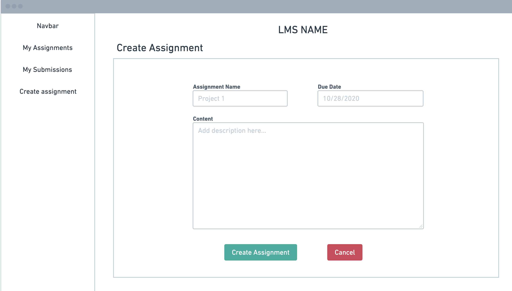

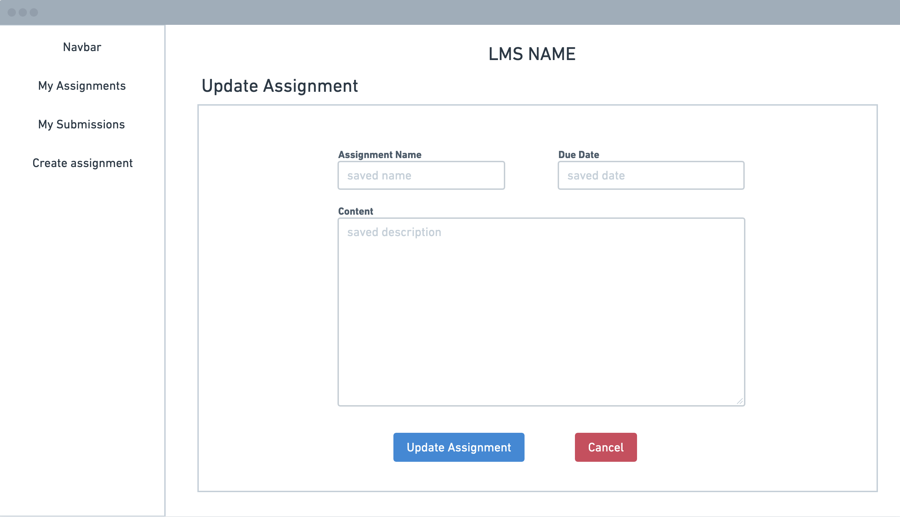

- Create/Update Submission Page

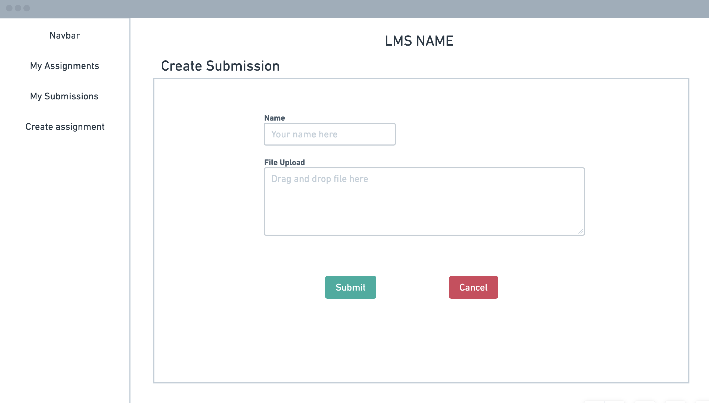

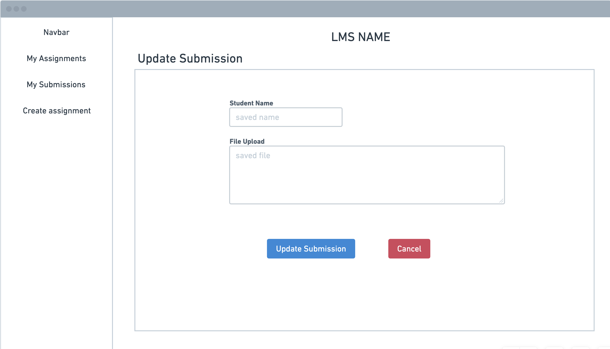

- 404 Page

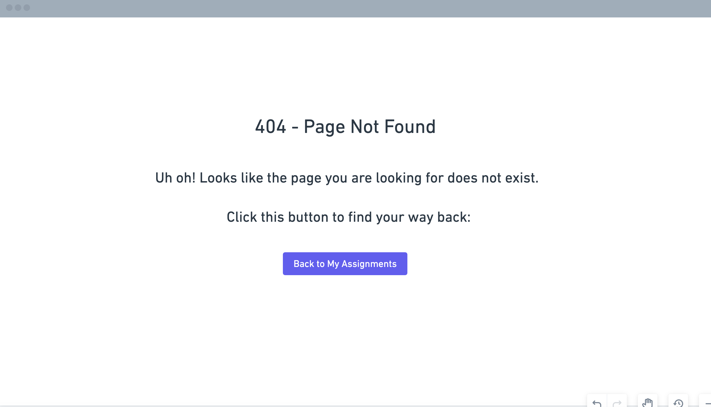